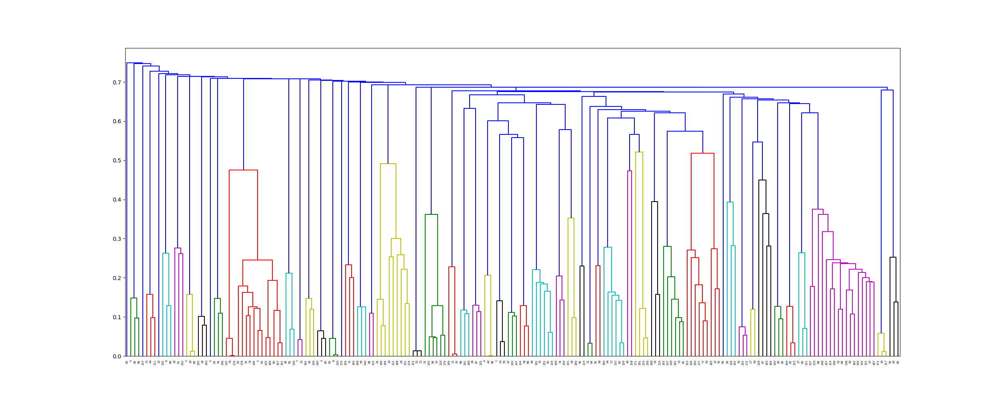
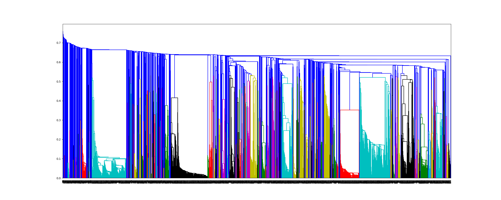

# set up SMAP.
Using a copy from qing Wang (her copied from Yu ZHOU). The version downloaded from [offical website](http://compsci.hunter.cuny.edu/~leixie/smap/smap.html) did not work.

SMAP could not find match between 2qmj and 3l4w, they are same protein.
```
smap_comp.sh 2qmj 3l4w /tmp/log
# No hit found
```
# use [TM-align](https://zhanglab.ccmb.med.umich.edu/TM-align/) for pocket clustering
```bash
# help: python TMalign.py -h 
# use F77 TMalign, less bugs.
python TMalign.py -d pdbbind/v2015 -e index/INDEX_core_data.2013 TMscore0.8/INDEX_core_data.2013.pocket_clust
```
>cluster v2015 core set based on TMdist (1 - TMscore)


>cluster v2105 refined set based on TMdist (1 - TMscore)


# Train on pocket cluster (based on TMalign)
```bash
# export PYTHONPATH=path_to/deepchem:$PYTHONPATH
python ../pdbbind_atomic_conv.py -data_dir pdbbind -save_dir sava_dir \
-version 2015 -subset refined -reload -split_complex -same_ligand \
-component binding -split pocket -clust_file cluster_ids/INDEX_refined_data.2015.TMscore0.5.json -seed 111
```
### v2015 refined, pocket split, protein alone, r2 0.561, reduce 0.08 compare to [sequence split](https://github.com/hnlab/deepchem/pull/1#issuecomment-510721589).