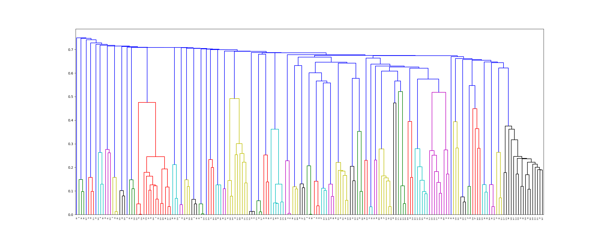

# set up SMAP.
Using a copy from qing Wang (her copied from Yu ZHOU). The version downloaded from [offical website](http://compsci.hunter.cuny.edu/~leixie/smap/smap.html) did not work.

SMAP could not find match between 2qmj and 3l4w, they are same protein.
```
smap_comp.sh 2qmj 3l4w /tmp/log
# No hit found
```
# Try [TM-align](https://zhanglab.ccmb.med.umich.edu/TM-align/)
```bash
# help: python TMalign.py -h 
python TMalign.py -d pdbbind/v2015 -e ./TMalign pdbbind/v2015/index/INDEX_core_data.2013 TMscore0.8/INDEX_core_data.2013.pocket_clust
```
>cluster core set based on TMdist (1 - TMscore)

